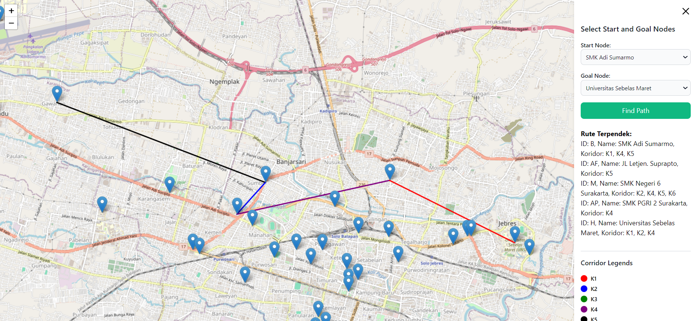
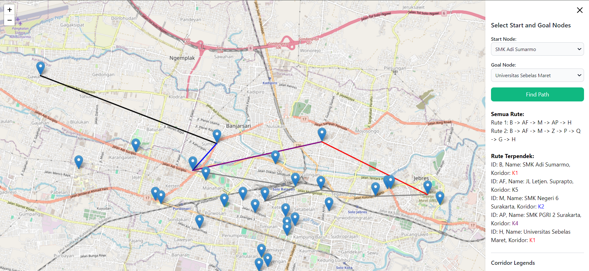

# SMA* BST Route Finder

This project is a web-based **Bus Route Finder** using the **Simplified Memory-Bounded A\*** (SMA*) algorithm. The project includes two versions of scripts and UI enhancements designed to help users find the shortest path between schools in **Surakarta (Solo)** using **graph-based route calculation**.

**Version 1:**

**Version 2:**

